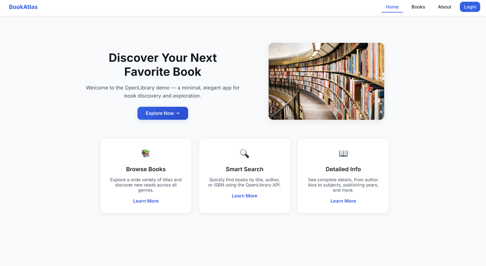
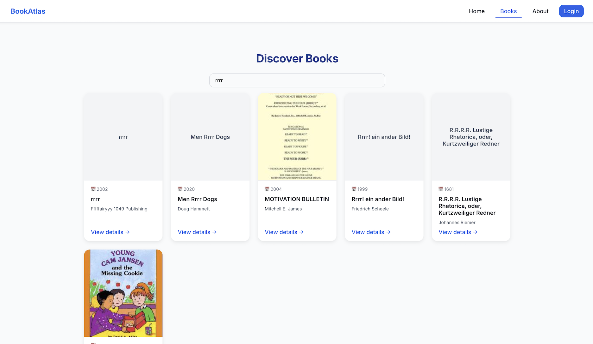

# 📚 BookAtlas Part#2

**BookAtlas** — это React-приложение для поиска и просмотра книг с помощью [OpenLibrary API](https://openlibrary.org/developers/api).  
Теперь приложение поддерживает **Firebase Authentication** и управление профилем пользователя с `username`.

---

## 🚀 Функциональность

- 🔍 **Поиск книг** — по названию, автору или ключевому слову (`/books?q=value`)  
- 📘 **Детали книги** — описание, авторы, темы, места, время, даты создания и изменения  
- ⚠️ **Обработка ошибок** — компонент `ErrorBox`  
- ⏳ **Индикатор загрузки** — компонент `Spinner`  
- 🎨 **Адаптивный и чистый интерфейс**  
- 🔐 **Аутентификация через Firebase** — регистрация, вход, выход  
- 👤 **Профиль пользователя** — email, UID и username

---

## 🧩 Структура страниц (Routing)

| Путь | Компонент | Описание |
|------|------------|-----------|
| `/` | **Home** | Главная страница с описанием и картинкой |
| `/about` | **About** | Информация о проекте |
| `/books` | **Items** | Поиск и список книг |
| `/books/:id` | **ItemDetails** | Подробности книги |
| `/login` | **Login** | Вход пользователя |
| `/signup` | **Signup** | Регистрация нового пользователя |
| `/profile` | **Profile** | Просмотр профиля (protected), email, UID, username |

---

## 🛠️ Технологии

| Технология | Назначение |
|-------------|------------|
| **React (Vite)** | Базовый фреймворк |
| **React Router DOM** | Клиентский роутинг |
| **Firebase Auth** | Аутентификация email/password, хранение username |
| **Fetch API / OpenLibrary API** | Получение данных о книгах и авторах |
| **CSS / Tailwind** | Адаптивное оформление и чистый дизайн |
| **React Context** | Управление состоянием пользователя (AuthContext) |

---

## ⚙️ Установка и запуск

1. **Клонировать репозиторий**
```bash
git clone https://github.com/yourusername/bookatlas.git
cd bookatlas
```

2. **Установить зависимости**
```bash
npm install
```

3. **Настроить Firebase**

Создать проект на Firebase Console

Включить Email/Password Authentication

Скопировать конфиг и создать src/firebase.js:

```bash
import { initializeApp } from "firebase/app";
import { getAuth } from "firebase/auth";

const firebaseConfig = {
  apiKey: "YOUR_API_KEY",
  authDomain: "YOUR_AUTH_DOMAIN",
  projectId: "YOUR_PROJECT_ID",
  storageBucket: "YOUR_STORAGE_BUCKET",
  messagingSenderId: "YOUR_MESSAGING_SENDER_ID",
  appId: "YOUR_APP_ID"
};

const app = initializeApp(firebaseConfig);
export const auth = getAuth(app);
```

3. **Запустить проект**
```bash
npm run dev
```

---

## 🖼️ Скриншоты

<div style="display: flex; justify-content: space-between; gap: 8px; flex-wrap: wrap;">
  
  
  
</div>


